# SG-01 — Affichage « Paramétrage des profils »

| | |
|---|---|
| **Objet** | Spécifications générales de l'affichage *Paramétrage › Profils* |
| **Composant** | Objet d'IHM Web Panorama `MyPnParametrage` (JavaScript pur), rubrique `profiles` |
| **Version analysée** | `MyPnParametrage` v1.3.0 + évolutions du 2026-10-08 (archive `MyPnParametrage.zip`) |
| **Statut** | Version 1.0 — rétro-spécification établie à partir du code livré |
| **Date** | 08/10/2026 |
| **Affichage associé** | [SG-02 — Paramétrage des utilisateurs](SG-02-parametrage-utilisateurs.md) |

> **Méthode.** Ce document décrit le comportement **réellement implémenté** dans
> l'archive (modules `param-split.js`, `param-table.js`, `param-rights.js`,
> `param-panel.js`, `param-ui.js`, `param-core.js`, `param-export.js`). Là où le
> `readme.txt` de l'archive diverge du code, c'est le code qui fait foi ; les
> écarts sont listés au § 12. Les captures ont été produites sur la page de test
> `demo.html` (12 profils, 12 groupes de droits, 25 comptes).

---

## 1. Objet et périmètre

L'affichage **Profils** permet à un administrateur de l'application de :

- consulter la liste des profils d'habilitation ;
- créer, modifier, dupliquer et supprimer un profil ;
- accorder ou retirer les **droits** d'un profil, groupe par groupe ;
- le cas échéant, renommer le **libellé** d'un droit du catalogue ;
- exporter la liste des profils (CSV, Excel).

Hors périmètre : la gestion des comptes (voir SG-02), le catalogue des droits lui-même
(codes, groupes, descriptions : fournis par l'application, non modifiables ici, sauf
libellés — § 6.6), la persistance en base (assurée par l'application hôte via
l'extension .NET `MyPnParametrageExtension`).

## 2. Documents de référence

| Réf. | Document |
|---|---|
| R1 | `MyPnParametrage/readme.txt` — installation, propriétés, formats JSON |
| R2 | `MyPnParametrage/Samples/readme.txt` — scripts Panorama d'ouverture et d'application |
| R3 | `Samples/OnOpenLoadParametrage.cs`, `Samples/OnChangeApplyParametrage.cs` |
| R4 | [SG-02 — Paramétrage des utilisateurs](SG-02-parametrage-utilisateurs.md) |

## 3. Accès à l'affichage

- L'écran *Paramétrage* comporte une **barre des rubriques** (onglets) : *Profils*,
  *Utilisateurs*, *Impressions*, *Diagnostique*, *Informations système*, *Journaux*
  (liste et ordre fixés par `configuration.sections`).
- La rubrique *Profils* est la rubrique active par défaut (`activeSection = "profiles"`).
- Sous la barre, le **fil d'Ariane** : bouton **≡** (menu) · *Paramétrage* ▸ pastille
  *Profils*. Un clic sur **≡** ou sur la racine émet une demande de navigation vers
  l'application (`navigationRequest_json`, cibles `menu` / `root`).
- Changer de rubrique émet `navigationRequest_json` (`source: "bar"`) et, si
  `localNavigation = true` (défaut), bascule l'écran immédiatement.
- Accès depuis la rubrique *Utilisateurs* : menu contextuel d'un compte
  « Voir le profil « X » » → rubrique *Profils*, profil X sélectionné
  (`source: "user"`).

## 4. Description générale de l'écran

### 4.1 Découpage

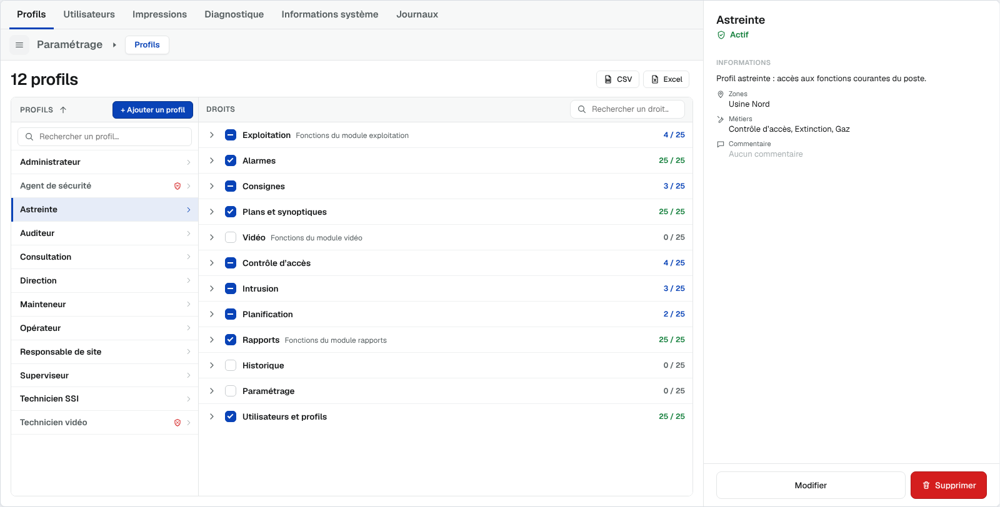

```
┌─ Rubriques : [Profils] Utilisateurs Impressions … ───────────┬─ PANNEAU DE DÉTAIL ──┐
│ ≡  Paramétrage ▸ (Profils)                                   │  (474 px, pleine     │
├──────────────────────────────────────────────────────────────┤   hauteur)           │
│ 12 profils                                    [CSV] [Excel]  │                      │
│ ┌─ ① LISTE DES PROFILS ──┬─ ② ZONE DES DROITS ─────────────┐ │  ③ consultation /    │
│ │ PROFILS ↑ [+ Ajouter]  │ DROITS  [n modif. Annuler Appl.] │ │     formulaire       │
│ │ [Rechercher un profil] │                 [Rechercher …]   │ │                      │
│ │ Administrateur       › │ ▸ ☑ Exploitation  …       4 / 25 │ │                      │
│ │ Agent de sécurité  ⊘ › │ ▸ ☑ Alarmes              25 / 25 │ │                      │
│ │ …                      │ …                                │ │ [Modifier][Supprimer]│
│ └────────────────────────┴──────────────────────────────────┘ │                      │
└──────────────────────────────────────────────────────────────┴──────────────────────┘
```

| Zone | Contenu |
|---|---|
| Ligne de titre | Compteur « *n* profils » ; boutons **CSV** et **Excel** |
| ① Liste des profils | Colonne gauche : en-tête, tri, bouton d'ajout, recherche, une ligne par profil |
| ② Zone des droits | Colonne droite : droits du profil sélectionné, regroupés en accordéons |
| ③ Panneau de détail | À droite de l'écran : fiche du profil (consultation ou formulaire) |

### 4.2 Mises en forme

Deux mises en forme existent ; **il n'y a pas de bouton de bascule** à l'écran, la mise en
forme est fixée par `configuration.profilesLayout` (ou l'API `setLayout`) :

| Mise en forme | Code | Description |
|---|---|---|
| **Deux colonnes** (défaut) | `split` | Liste des profils à gauche, droits du profil sélectionné à droite (pleine hauteur) |
| Tableau | `table` | Tableau des profils ; les droits se déplient **sous la ligne** du profil (§ 5.4) |

Les modifications de droits en attente sont conservées lors d'un changement de mise en forme.

## 5. Description détaillée des zones

### 5.1 Ligne de titre

| Élément | Règle |
|---|---|
| Titre | « *n* profils » / « 1 profil » / « Aucun profil ». Pendant une recherche : « *n* profils sur *total* » |
| **CSV** | Export CSV de la vue courante (§ 7). Masqué si `rights.export = false` |
| **Excel** | Export .xlsx de la vue courante, avec feuille *Droits* (§ 7). Masqué si `rights.export = false` |
| **+ Ajouter un profil** | En mise en forme *Tableau* seulement (en *Deux colonnes*, il est dans l'en-tête de la liste) |

### 5.2 Liste des profils (zone ①)

| Élément | Description |
|---|---|
| En-tête « PROFILS » | Libellé + bouton de **tri par nom** (flèche ↑ / ↓ ; un clic inverse le sens) |
| **+ Ajouter un profil** | Ouvre le panneau en création. Visible si `rights.create`. **Grisé** à 40 profils (info-bulle « Limite de 40 profils atteinte. ») |
| Recherche | Champ « Rechercher un profil… » : filtre sur le **nom** seul ; plusieurs mots = ET ; insensible à la casse et aux accents ; saisie amortie (120 ms) ; **Échap** efface |
| Ligne de profil | Nom du profil (description en info-bulle) ; icône **⊘** rouge si le profil est **inactif** ; chevron › |
| Ligne sélectionnée | Fond bleu pâle + liseré bleu à gauche |
| Profil inactif | Nom en gris + icône ⊘ (info-bulle « Inactif ») |
| Liste vide | « Aucun profil à afficher. » |
| Aucun résultat | « Aucun profil ne correspond. » |

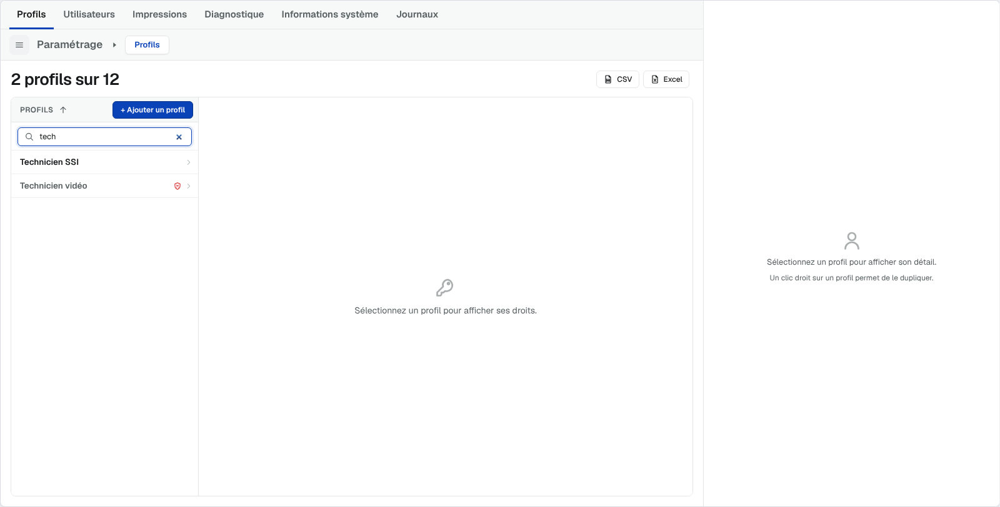

*Recherche « tech » : le titre devient « 2 profils sur 12 ».*

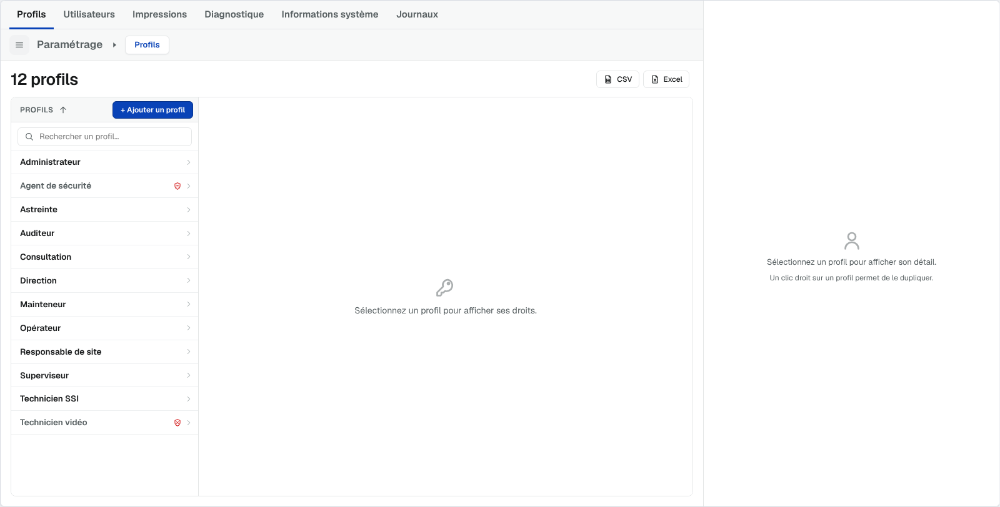

*État initial : aucun profil sélectionné — la zone des droits affiche « Sélectionnez un
profil pour afficher ses droits. » et le panneau « Sélectionnez un profil pour afficher son
détail. — Un clic droit sur un profil permet de le dupliquer. »*

**Interactions sur une ligne :**

| Action | Effet |
|---|---|
| Clic | Sélectionne le profil : droits affichés en zone ②, fiche en consultation en zone ③ |
| Double-clic | Sélectionne puis ouvre le formulaire de **modification** (si `rights.edit`) |
| Clic droit | Menu contextuel (§ 5.5) |
| Clavier ↑ / ↓ | Déplace le focus de ligne en ligne |
| Clavier Entrée / Espace / → | Sélectionne le profil |
| Clavier Menu ou Maj+F10 | Ouvre le menu contextuel |

La recherche est conservée au re-rendu de la liste (tri, renvoi de `profiles_json`).

### 5.3 Zone des droits (zone ②)

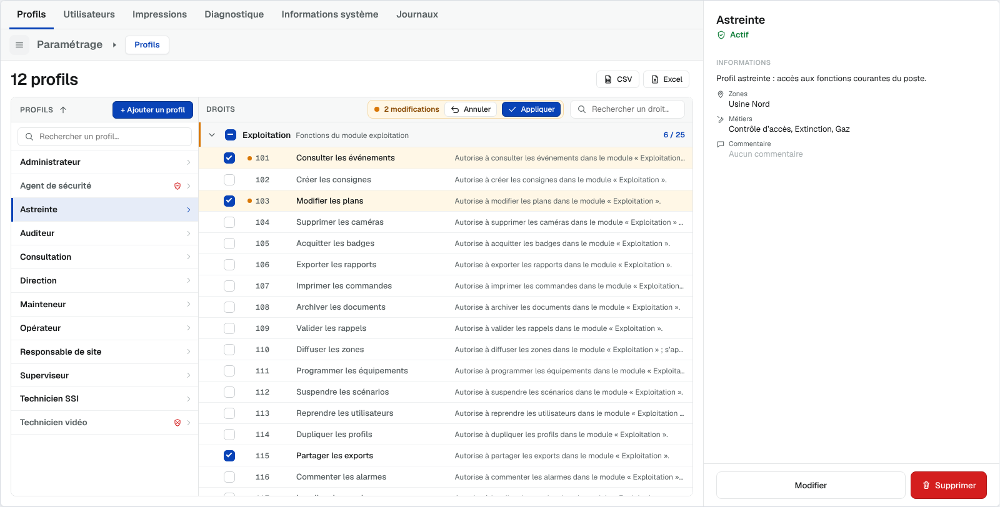

**Barre collante** (reste visible au défilement) :

| Élément | Description |
|---|---|
| Titre « DROITS » | En *Tableau*, suivi du nom du profil. Badge « 🔒 Consultation seule » si `rights.editRights = false` |
| Zone de validation | **N'apparaît qu'à la première modification** : point orange · « *n* modifications » · **Annuler** · **Appliquer** |
| Recherche | « Rechercher un droit… » : porte sur le **code, le libellé et la description** du droit (pas sur le nom du groupe) ; plusieurs mots = ET ; insensible aux accents ; les groupes contenant une correspondance sont **dépliés**, les autres masqués ; « Aucun droit ne correspond. » si rien ; Échap efface |

**Accordéon par groupe** :

| Élément | Description |
|---|---|
| Chevron | Déplie / replie le groupe (un clic sur le nom fait de même) |
| Case tri-état | Cochée = tous les droits du groupe accordés ; indéterminée (—) = une partie ; vide = aucun. Clic : *indéterminée ou vide → tout accorder* ; *cochée → tout retirer* |
| Nom + description du groupe | Description en gris, tronquée (texte complet en info-bulle) |
| Compteur | « *n* / *total* » (vert si complet, bleu si partiel, gris si aucun) |
| État initial | Tous les groupes **repliés** (déplié d'office s'il n'y a qu'un groupe) |

**Ligne de droit** :

| Colonne | Description |
|---|---|
| Case à cocher | Le profil possède / ne possède pas le droit |
| Code | Code numérique interne, police à chasse fixe, non modifiable |
| Libellé | Texte non modifiable ; devient un champ de saisie **uniquement** si `rights.editLabels = true` (§ 6.6) |
| Description | Non modifiable, tronquée, texte complet en info-bulle |

**Suivi des modifications** : chaque droit modifié porte un **fond jaune pâle et un point
orange** ; son groupe porte un **liseré orange**. Les modifications restent locales jusqu'à
**Appliquer**.

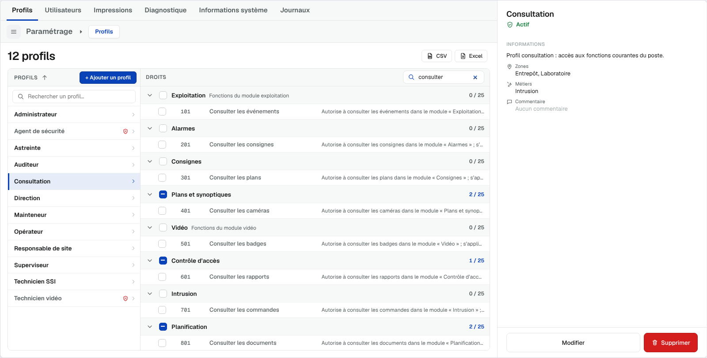

### 5.4 Mise en forme « Tableau » (variante)

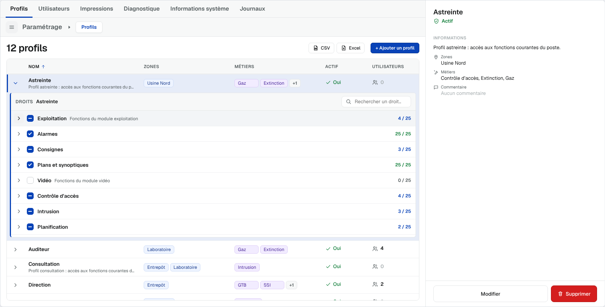

| Colonne | Contenu | Tri |
|---|---|---|
| (chevron) | Déplie / replie la zone des droits sous la ligne | — |
| **Nom** | Nom du profil + description sur une 2ᵉ ligne | oui |
| **Zones** | Étiquettes (2 au plus, puis « +n ») | oui |
| **Métiers** | Étiquettes (2 au plus, puis « +n ») | oui |
| **Actif** | ✓ Oui / Non | oui |
| **Utilisateurs** | Nombre de comptes ayant le profil | oui |

- Colonnes choisies et ordonnées par `configuration.columns` (*Nom* toujours présente).
- Une seule ligne dépliée à la fois ; hauteur maximale de la zone = 60 % de la hauteur
  visible du tableau (`rightsMaxHeightRatio`, 0,2 à 1), avec défilement propre.
- Clavier : → déplie, ← replie.

### 5.5 Menu contextuel d'un profil

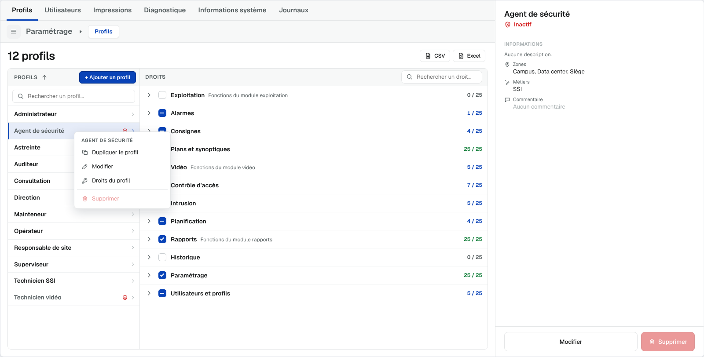

Titre = nom du profil, puis :

| Entrée | Condition d'affichage | Action |
|---|---|---|
| Dupliquer le profil | `rights.duplicate` et `rights.create` | § 6.4 |
| Modifier | `rights.edit` | § 6.3 |
| Droits du profil | toujours | Affiche les droits du profil |
| *(séparateur)* Supprimer | `rights.delete` ; **grisé** si des utilisateurs ont le profil (info-bulle « Suppression impossible : *n* utilisateur(s) ont ce profil. ») | § 6.5 |

### 5.6 Panneau de détail (zone ③)

#### a) Vide
Icône + « Sélectionnez un profil pour afficher son détail. » / « Un clic droit sur un
profil permet de le dupliquer. »

#### b) Consultation

| Élément | Contenu |
|---|---|
| Titre | Nom du profil |
| Statut | ✓ « Actif » (vert) ou ⊘ « Inactif » (rouge) |
| Section **INFORMATIONS** | Description (ou « Aucune description. ») |
| Zones | Libellés triés alphabétiquement, séparés par « , » (ou « — ») |
| Métiers | Idem |
| Commentaire | Texte (ou « Aucun commentaire ») |
| Pied | **Modifier** (si `rights.edit`) · **Supprimer** (si `rights.delete`, grisé avec info-bulle tant qu'au moins un utilisateur a ce profil) |

Le libellé est **au-dessus** de sa valeur (pas de colonne de libellés à largeur fixe), pour
supporter des traductions plus longues.

#### c) Formulaire (modification / création / duplication)

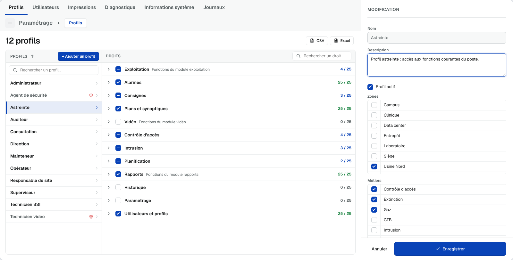

| Champ | Type | Règles |
|---|---|---|
| En-tête | — | « MODIFICATION », « NOUVEAU PROFIL » ou « DUPLICATION » (+ « Modèle : *X* ») |
| **Nom** | texte, 80 car. max | Obligatoire, unique (RG-PRF-02). **Lecture seule en modification** (info-bulle « Le nom d'un profil existant ne peut pas être modifié. ») |
| Description | zone de texte, 500 car. max | Facultative |
| Profil actif | case à cocher | Cochée par défaut en création |
| Zones | liste à cases à cocher triée par libellé si un dictionnaire `areas` est fourni ; sinon saisie libre séparée par des virgules | Les valeurs hors dictionnaire sont conservées, cochées, en fin de liste (italique) |
| Métiers | idem (dictionnaire `skills`) | idem |
| Commentaire | zone de texte, 1 000 car. max | Facultatif (stocké dans `extra.comment`) |
| Droits | information (duplication seulement) | « *n* droits sur *total* » hérités du modèle |
| Pied | — | **Annuler** · **Enregistrer** (modification) ou **Créer le profil** (création / duplication) |

Raccourcis : **Ctrl+Entrée** (ou Entrée dans un champ texte) enregistre ; **Échap** annule
(sans confirmation). Focus initial : *Nom* en création, *Description* en modification.

## 6. Fonctions

### 6.1 Consulter un profil
Sélection d'une ligne → zone ② (droits) + zone ③ (consultation) ; émission de
`selectedProfile_json` `{ id, profile }`.

### 6.2 Créer un profil
1. **+ Ajouter un profil** → formulaire vierge (« NOUVEAU PROFIL »).
2. Saisie, puis **Créer le profil**.
3. Contrôles (RG-PRF-02). En cas d'erreur, message sous le champ *Nom*, focus sur le champ.
4. Le profil est créé **sans droit ni utilisateur**, avec un identifiant provisoire
   `profile-…` ; il est sélectionné et ses droits sont affichés (à accorder ensuite).
5. Émission `profileChanges_json` `{ action: "create", profile }` ; toast « Profil créé. ».

### 6.3 Modifier un profil
Bouton **Modifier**, double-clic ou menu contextuel → formulaire pré-rempli, nom figé.
**Enregistrer** → `profileChanges_json` `{ action: "update", profile }` ; toast « Profil
enregistré. ». Les droits ne se modifient **pas** dans ce formulaire mais dans la zone ②.

### 6.4 Dupliquer un profil
Menu contextuel **Dupliquer le profil** → formulaire en mode création pré-rempli :

- nom « Copie de *X* » (suffixe « (2) », « (3) »… si ce nom existe déjà), sélectionné ;
- mêmes description, état actif, zones, métiers, commentaire **et mêmes droits** ;
- **aucun utilisateur**.

Toast « Profil dupliqué : complétez puis enregistrez. ». **Créer le profil** →
`profileChanges_json` `{ action: "duplicate", profile, sourceId }`.

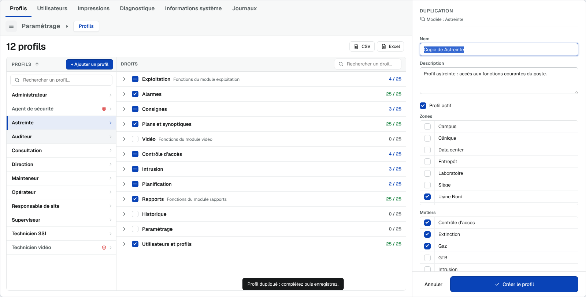

### 6.5 Supprimer un profil
- Interdit tant qu'au moins un utilisateur possède le profil (bouton et entrée de menu
  grisés ; toast « Suppression impossible : *n* utilisateur(s) ont ce profil. »).
- Sinon : dialogue « Supprimer le profil » — « Supprimer définitivement le profil « *X* » ? »
  — **Annuler** / **Supprimer**.
- Si le profil supprimé a des droits modifiés en attente, le garde-fou (§ 6.7) s'applique
  d'abord.
- Émission `profileChanges_json` `{ action: "delete" }` puis `selectedProfile_json`
  `{ id: null }` ; toast « Profil supprimé. ».

### 6.6 Modifier les droits d'un profil
1. Cocher / décocher des droits ou des groupes entiers dans la zone ②.
2. La zone de validation affiche « *n* modifications ».
3. **Appliquer** (ou **Ctrl+Entrée**) : émission de `rightsChanges_json` avec les **seuls
   écarts** : `{ profileId, grant: [codes], revoke: [codes], labels: {code: libellé} }` ;
   toast « Droits appliqués (*n* modification(s)). ».
4. **Annuler** (ou **Échap**) : retour à l'état d'origine.

**Libellés des droits** (si `rights.editLabels = true`) : le libellé devient un champ
discret (bordure au survol / focus, crayon). Un bouton « Rétablir le libellé » apparaît dès
que le libellé diffère du catalogue. Un libellé vidé reprend la valeur du catalogue. Les
libellés sont **communs à tous les profils** (catalogue).

### 6.7 Garde-fou « Modifications non appliquées »

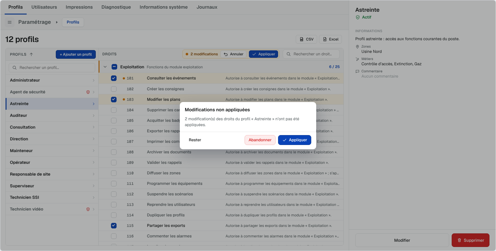

Déclenché si des droits sont modifiés et non appliqués lorsque l'opérateur : sélectionne un
autre profil, replie la ligne (*Tableau*), change de rubrique (barre ou fil d'Ariane),
supprime le profil affiché.

> « *n* modification(s) des droits du profil « *X* » n'ont pas été appliquées. »
> **Rester** (ne rien faire) · **Abandonner** (restaurer puis continuer) · **Appliquer**
> (émettre puis continuer).

Sont **sans effet** sur les modifications en attente : le tri, la recherche, le renvoi de
`profiles_json` / `rightsCatalog_json` par l'application, un aller-retour vers la rubrique
*Utilisateurs*, un changement de mise en forme.

Si le **formulaire du panneau** est ouvert et qu'un autre profil est sélectionné, un dialogue
« Modifications non appliquées » propose **Rester** / **Abandonner**.

## 7. Exports

| Format | Contenu |
|---|---|
| **CSV** | UTF-8 avec BOM, séparateur « ; », fichier `<exportFileName \| profils>-AAAA-MM-JJ.csv` |
| **Excel** | Classeur .xlsx natif (en-tête gras figé, filtre automatique) : feuille **Profils** + feuille **Droits** (matrice groupe / code / libellé × profils exportés, ✓ = accordé) |

- Colonnes *Profils* : Nom, Description, Zones, Métiers, Actif, Utilisateurs (nombre),
  Droits accordés, Droits (total).
- Périmètre : **vue courante** (tri en cours ; en *Deux colonnes*, profils filtrés par la
  recherche).
- L'impression reste disponible par l'API `exportView('print', 'profiles')` (pas de bouton).
- Chaque export écrit `exportRequest_json` (`handled: true` si l'objet a produit le fichier ;
  sinon toast et relais possible par un export serveur).

## 8. Règles de gestion

| Réf. | Règle |
|---|---|
| RG-PRF-01 | 40 profils au maximum : au-delà, les profils reçus sont ignorés et la création est bloquée |
| RG-PRF-02 | Le nom est obligatoire et unique (comparaison insensible à la casse et aux accents) : « Le nom est obligatoire. » / « Un profil porte déjà ce nom. » |
| RG-PRF-03 | Le nom d'un profil existant n'est pas modifiable |
| RG-PRF-04 | Un profil possédé par au moins un utilisateur ne peut pas être supprimé |
| RG-PRF-05 | Un profil créé n'a ni droit ni utilisateur ; un profil dupliqué hérite des droits du modèle mais d'aucun utilisateur |
| RG-PRF-06 | Un profil **inactif** reste attribuable ; il est signalé (⊘, texte barré dans la fiche utilisateur) |
| RG-PRF-07 | Catalogue : 40 groupes × 25 droits au maximum (1 000 droits) ; le surplus est ignoré ; les codes sont comparés comme des chaînes |
| RG-PRF-08 | Les modifications de droits ne sont transmises qu'à **Appliquer**, sous forme d'écarts (grant / revoke / labels) |
| RG-PRF-09 | Les libellés de droits ne sont modifiables que si `editLabels` est accordé **explicitement** (et `editRights` non refusé) |
| RG-PRF-10 | L'identifiant d'un profil créé ou dupliqué est généré par l'objet (`profile-…`) ; l'application peut le remplacer en renvoyant `profiles_json` |
| RG-PRF-11 | `profiles_json` remplace la liste à chaque réception ; la sélection, la ligne dépliée, les droits en attente et un brouillon en cours sont conservés si le profil existe toujours |
| RG-PRF-12 | Les exports ne contiennent jamais de mot de passe |

## 9. Droits de l'opérateur

Fournis par `configuration_json.rights` (dans l'exemple Panorama, déduits du profil
Panorama de l'opérateur, constante `C_PROFILS_ADMIN`).

| Droit | Défaut | Effet dans l'affichage Profils |
|---|---|---|
| `create` | oui | Bouton « + Ajouter un profil » |
| `duplicate` | oui (exige `create`) | Entrée « Dupliquer le profil » |
| `edit` | oui | Bouton « Modifier », double-clic, entrée de menu |
| `delete` | oui | Bouton et entrée « Supprimer » |
| `editRights` | oui | Cases des droits et des groupes actives (sinon badge « Consultation seule ») |
| `editLabels` | **non** | Libellés de droits modifiables |
| `export` | oui | Boutons CSV / Excel |

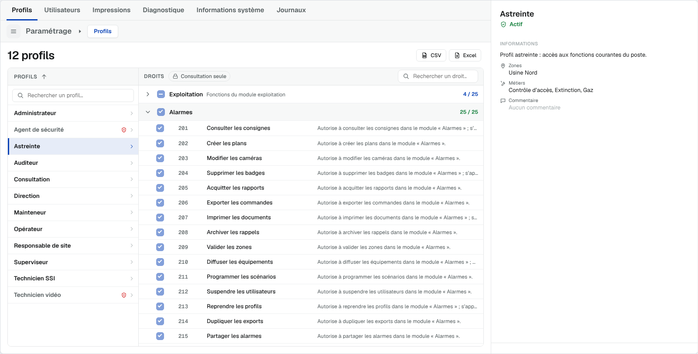

## 10. Interfaces (propriétés Panorama)

| Propriété | Sens | Contenu |
|---|---|---|
| `configuration_json` | lue | `profilesLayout`, `columns`, `sort`, `areas`, `skills`, `rights`, `exportFileName`, `rightsMaxHeightRatio`, `texts`, `locale`… |
| `rightsCatalog_json` | lue | `[ { id, name, description, order, rights: [ { code, label, description } ] } ]` |
| `profiles_json` | lue | `[ { id, name, description, areas, skills, authorized, rights: [codes], users: [ { id, name, login, lastLogin } ], extra } ]` |
| `selectedProfile_json` | écrite | `{ id, profile }` / `{ id: null, profile: null }` |
| `profileChanges_json` | écrite | `{ action: create \| update \| delete \| duplicate, profile, sourceId? }` |
| `rightsChanges_json` | écrite | `{ profileId, grant, revoke, labels }` |
| `navigationRequest_json` | écrite | `{ target, section, source }` |
| `exportRequest_json` | écrite | `{ section: "profiles", scope, format, handled, count, sort, query, fileName, layout }` |
| `viewState_json` | écrite | `{ section, layout, selectedId, expandedId, sort, pendingRights, panelMode, count }` |

Ordre d'alimentation à l'ouverture : `configuration_json` → `rightsCatalog_json` →
`profiles_json` → `users_json`. Après traitement d'une écriture, le script
`OnChangeApplyParametrage.cs` applique le changement (`MyPnPaApplyProfileChange`,
`MyPnPaApplyRightsChange`), relit les listes et remet la propriété traitée à `""`.

## 11. Ergonomie et accessibilité

- Navigation clavier complète dans la liste (§ 5.2) et dans le formulaire (Ctrl+Entrée,
  Échap).
- Onglets de rubriques : `role="tablist"`, flèches / Début / Fin.
- Liste : `role="listbox"`, lignes `role="option"` avec `aria-selected`.
- Libellés au-dessus des valeurs ; textes en français et en anglais (`locale`), surcharge
  possible par `configuration.texts`.
- Performances mesurées : zone de 1 000 droits construite en ~50 ms ; tri ou renvoi de
  `profiles_json` zone dépliée ~100–200 ms.

## 12. Écarts relevés entre `readme.txt` et le code livré

À arbitrer par le chef de projet (le présent document suit le code) :

| # | `readme.txt` | Code livré (fait foi ici) |
|---|---|---|
| E1 | Colonnes « Areas », « Skills », « Autorisé » | Libellés « **Zones** », « **Métiers** », « **Actif** » ; statut « Actif / Inactif » |
| E2 | Liste des profils : nombre d'utilisateurs par ligne | Pas de compteur dans la liste *Deux colonnes* (seulement en *Tableau*) |
| E3 | Barre des droits : compteur « *n* / *total* accordés », boutons « Tout déplier / Tout replier » | Absents de la barre (textes présents dans le dictionnaire, non utilisés) |
| E4 | Consultation : badge « *n* droits sur *total* », liste des utilisateurs du profil (initiales, dernière connexion) | Absents ; la fiche montre *Informations* (description, zones, métiers, **commentaire**) |
| E5 | Formulaire : « nom obligatoire et unique » (modifiable) | Nom **figé** en modification |
| E6 | — | Champ **Commentaire** (stocké dans `extra.comment`) non documenté |
| E7 | Garde-fou du formulaire profil | Message réduit à « Annuler ? » (Rester / Abandonner) — libellé à améliorer |
| E8 | Échap dans le formulaire profil | Annule **sans confirmation**, contrairement au formulaire utilisateur |
