# SG-02 — Affichage « Paramétrage des utilisateurs »

| | |
|---|---|
| **Objet** | Spécifications générales de l'affichage *Paramétrage › Utilisateurs* |
| **Composant** | Objet d'IHM Web Panorama `MyPnParametrage` (JavaScript pur), rubrique `users` |
| **Version analysée** | `MyPnParametrage` v1.3.0 + évolutions du 2026-10-08 (archive `MyPnParametrage.zip`) |
| **Statut** | Version 1.0 — rétro-spécification établie à partir du code livré |
| **Date** | 08/10/2026 |
| **Affichage associé** | [SG-01 — Paramétrage des profils](SG-01-parametrage-profils.md) |

> **Méthode.** Ce document décrit le comportement **réellement implémenté** dans
> l'archive (modules `param-users.js`, `param-userpanel.js`, `param-ui.js`,
> `param-core.js`, `param-export.js`). Là où le `readme.txt` diverge du code, c'est le
> code qui fait foi ; les écarts sont listés au § 13. Les captures ont été produites sur
> la page de test `demo.html` (12 profils, 25 comptes).

---

## 1. Objet et périmètre

L'affichage **Utilisateurs** permet :

- à un **administrateur des comptes** (droit `edit`) de consulter, rechercher, filtrer,
  créer, modifier, désactiver / réactiver et supprimer les comptes utilisateurs, et de
  leur attribuer des profils ;
- à **tout opérateur** de consulter et de mettre à jour **sa propre fiche** (nom détaillé,
  e-mail, langue, mot de passe) ;
- d'exporter la liste affichée (CSV, Excel).

Hors périmètre : la définition des profils et de leurs droits (SG-01), le stockage des mots
de passe (haché par l'application hôte), l'annuaire externe lui-même.

## 2. Documents de référence

| Réf. | Document |
|---|---|
| R1 | `MyPnParametrage/readme.txt` — §§ 1.2, 1.3, 5, 6, 7, 10 |
| R2 | `MyPnParametrage/Samples/readme.txt` |
| R3 | `Samples/OnChangeApplyParametrage.cs`, `Samples/OnChangeServerRequest.cs` (`session.moi`, `session.motDePasse`) |
| R4 | [SG-01 — Paramétrage des profils](SG-01-parametrage-profils.md) |

## 3. Accès à l'affichage

- Onglet **Utilisateurs** de la barre des rubriques (ou `activeSection = "users"`).
- Fil d'Ariane : **≡** · *Paramétrage* ▸ pastille *Utilisateurs*.
- Le tableau n'est construit que lorsque la rubrique est active.
- **Opérateur connecté** : donné par `configuration.currentUser` (`"login"` ou
  `{ login, id, name, admin }`) ; à défaut, l'objet le demande au serveur
  (`serverRequest_json`, action `session.moi`). Il détermine la « fiche personnelle »
  (badge **Vous**, § 6.6).

## 4. Description générale de l'écran

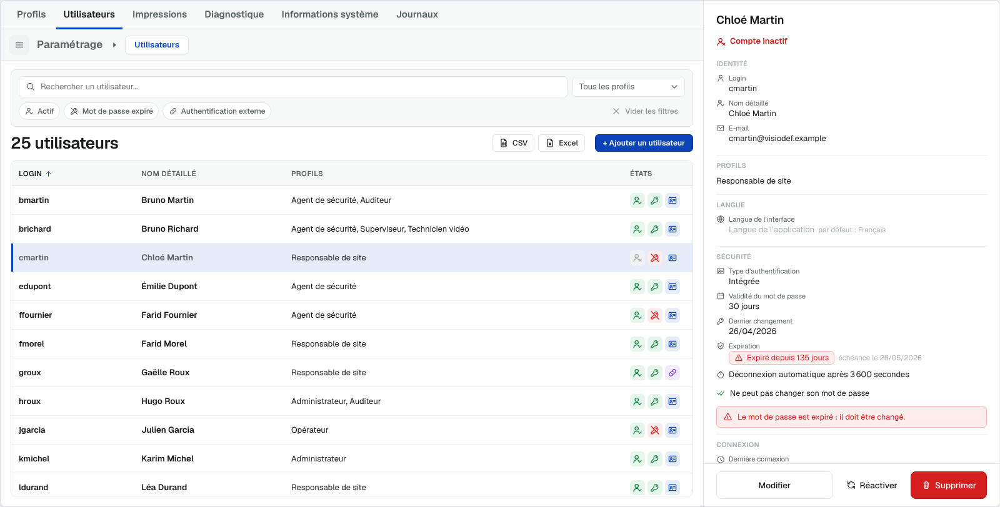

```
┌─ Rubriques : Profils [Utilisateurs] Impressions … ───────────┬─ PANNEAU DE DÉTAIL ──┐
│ ≡  Paramétrage ▸ (Utilisateurs)                              │                      │
├──────────────────────────────────────────────────────────────┤  ③ consultation /    │
│ ┌─ ① ZONE DE FILTRES ──────────────────────────────────────┐ │     formulaire       │
│ │ [🔍 Rechercher un utilisateur…        ] [Tous les profils▾]│ │                      │
│ │ (Actif) (Mot de passe expiré) (Authentif. externe)  ✕ Vider│ │                      │
│ └──────────────────────────────────────────────────────────┘ │                      │
│ 25 utilisateurs               [CSV] [Excel] [+ Ajouter un …] │                      │
│ ┌─ ② TABLEAU ──────────────────────────────────────────────┐ │                      │
│ │ LOGIN ↑ │ NOM DÉTAILLÉ │ PROFILS              │ ÉTATS     │ │                      │
│ │ bmartin │ Bruno Martin │ Agent de sécurité, … │ 👤 🔑 🪪  │ │ [Modifier][Supprimer]│
│ └──────────────────────────────────────────────────────────┘ │                      │
└──────────────────────────────────────────────────────────────┴──────────────────────┘
```

| Zone | Contenu |
|---|---|
| ① Zone de filtres | En tête de la rubrique, au-dessus du titre : recherche, filtre Profils, pastilles d'états |
| Ligne de titre | Compteur ; boutons **CSV**, **Excel**, **+ Ajouter un utilisateur** |
| ② Tableau des utilisateurs | Liste à plat, une ligne par compte |
| ③ Panneau de détail | Fiche du compte : vide, consultation ou formulaire |

## 5. Description détaillée des zones

### 5.1 Zone de filtres (zone ①)

**Ligne 1**

| Élément | Description |
|---|---|
| Recherche | « Rechercher un utilisateur… » : porte sur **login, nom détaillé, e-mail et noms des profils** ; plusieurs mots = ET ; insensible à la casse et aux accents ; saisie amortie (150 ms) ; croix d'effacement ; **Échap** efface |
| Liste « Tous les profils » | Liste déroulante à **choix multiples** (§ 5.1.1) |

**Ligne 2**

| Élément | Description |
|---|---|
| Pastille **Actif** | Filtre à 3 états sur l'activation du compte |
| Pastille **Mot de passe expiré** | Filtre à 3 états sur l'expiration du mot de passe |
| Pastille **Authentification externe** | Filtre à 3 états sur le type d'authentification |
| **Vider les filtres** | Remet à zéro tous les critères **y compris la recherche** ; grisé tant qu'aucun critère n'est actif |

Une pastille passe, à chaque clic, par : *indifférent* → *oui* (✓) → *non* (✕) →
*indifférent*. Info-bulle : « *Libellé* : *état* (cliquer pour changer) ».

Tous les critères se **cumulent (ET)**. Le titre devient « *n* utilisateurs sur *total* »
dès qu'un critère est actif.

#### 5.1.1 Liste déroulante des profils

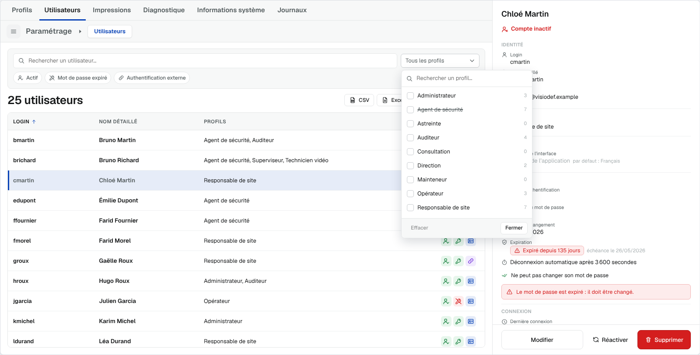

- Un élément par profil, trié par nom, avec **case à cocher** et **nombre de comptes**
  possédant le profil ; profil inactif **barré**.
- Élément « **Sans profil** » en fin de liste s'il existe des comptes sans profil.
- Champ « Rechercher un profil… » en tête de liste au-delà de **10 profils**.
- Pied : **Effacer** (grisé si rien n'est coché) · **Fermer**. Clic extérieur ou Échap ferme.
- Règle : un compte est retenu s'il possède **au moins un** des profils cochés (OU).
- Bouton replié : « Tous les profils » si rien n'est coché ; sinon le premier profil en
  **puce supprimable** (×) suivie de « +*n* » (les autres en info-bulle).

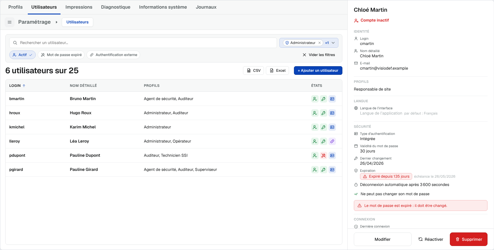

### 5.2 Ligne de titre

| Élément | Règle |
|---|---|
| Titre | « *n* utilisateurs » / « 1 utilisateur » / « Aucun utilisateur » ; filtré : « *m* utilisateurs sur *n* » |
| **CSV**, **Excel** | Export de la **liste affichée** (§ 8). Masqués si `rights.export = false` |
| **+ Ajouter un utilisateur** | Visible si `rights.create` ; **grisé** à 30 comptes (« Limite de 30 utilisateurs atteinte. ») |

### 5.3 Tableau des utilisateurs (zone ②)

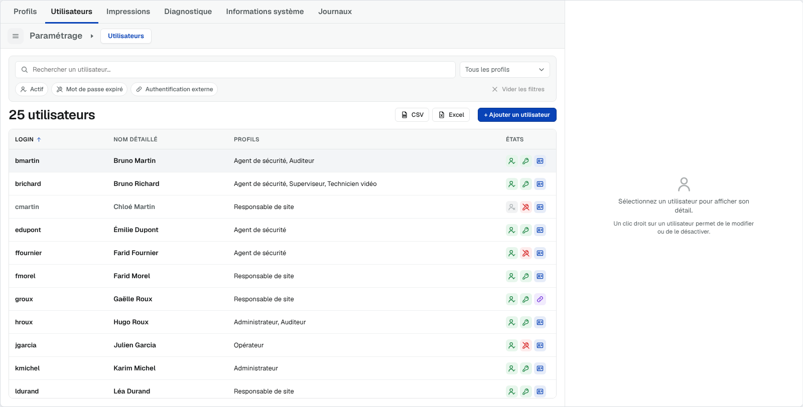

| Colonne | Contenu | Tri |
|---|---|---|
| **Login** | Identifiant de connexion | oui (défaut, croissant) |
| **Nom détaillé** | Nom seul (l'e-mail n'est pas affiché mais reste cherchable, visible dans le panneau et les exports) | oui |
| **Profils** | Libellés triés alphabétiquement, séparés par « , » ; liste complète en info-bulle ; « Aucun profil attribué. » sinon | oui |
| **États** | 3 icônes à deux états (§ 5.3.1) | oui : inactifs, puis expirés, puis externes en dernier |

- Pas d'avatar ni de badge ; un **compte désactivé** est **grisé**.
- Colonnes choisies et ordonnées par `configuration.userColumns` ; *Login* et *États*
  toujours présentes.
- Tri : clic (ou Entrée / Espace) sur l'en-tête ; un second clic inverse le sens.
- « Aucun utilisateur à afficher. » (liste vide) ; « Aucun utilisateur ne correspond. »
  (filtre sans résultat).

#### 5.3.1 Colonne « États »

| Indicateur | État 1 | État 2 |
|---|---|---|
| Activation | Silhouette cochée, **vert** — « Compte actif » | Silhouette barrée, **gris** — « Compte inactif » |
| Mot de passe | Clé, **vert** — « Mot de passe valide » | Clé barrée, **rouge** — « Mot de passe expiré » |
| Authentification | Carte d'identité, **bleu** — « Authentification intégrée » | Chaîne, **violet** — « Authentification externe » |

L'info-bulle du mot de passe précise l'échéance (« Expire dans 9 jours », « Expiré depuis
135 jours »…). Les mêmes icônes sont reprises dans les pastilles de filtre, le panneau et le
formulaire.

#### 5.3.2 Interactions

| Action | Effet |
|---|---|
| Clic | Sélectionne le compte → panneau en consultation ; émission `selectedUser_json` |
| Double-clic | Sélectionne puis ouvre le formulaire de modification (si `rights.edit`) |
| Clic droit | Menu contextuel (§ 5.4) |
| ↑ / ↓ | Ligne visible suivante / précédente |
| Entrée / Espace | Sélectionne |
| Menu ou Maj+F10 | Menu contextuel |

### 5.4 Menu contextuel d'un compte

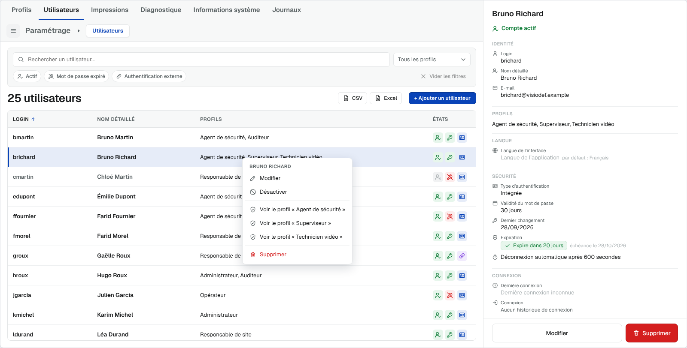

Titre = nom détaillé, puis :

| Entrée | Condition | Action |
|---|---|---|
| Modifier | `rights.edit` | § 6.3 |
| Désactiver / Réactiver | `rights.edit` (selon l'état) | § 6.5 |
| *(séparateur)* Voir le profil « *X* » | une entrée par profil du compte (6 au plus, triés) | Rubrique *Profils*, profil X sélectionné |
| *(séparateur)* Supprimer | `rights.delete` | § 6.4 |

### 5.5 Panneau de détail (zone ③)

#### a) Vide
« Sélectionnez un utilisateur pour afficher son détail. » / « Un clic droit sur un
utilisateur permet de le modifier ou de le désactiver. »

#### b) Consultation

| Bloc | Contenu |
|---|---|
| En-tête | Badge **Vous** (fiche de l'opérateur connecté uniquement) ; nom détaillé |
| État d'activation | Une ligne : icône + « Compte actif » (vert) / « Compte inactif » (rouge) |
| **IDENTITÉ** | Login · Nom détaillé · E-mail (« — » si vide) |
| **PROFILS** | Libellés triés séparés par « , » (ou « Aucun profil attribué. ») |
| **LANGUE** | Langue de l'interface du compte, ou « Langue de l'application (par défaut : Français) » |
| **SÉCURITÉ** | Type d'authentification (« Intégrée » / « Externe ») · Validité du mot de passe (« *n* jours » / « Illimitée ») |
| | *Authentification intégrée seulement* : Dernier changement (date ou « non disponible ») · Expiration (pastille § 5.5.1 + « échéance le JJ/MM/AAAA ») |
| | Déconnexion automatique en une ligne : « Déconnexion automatique après 900 secondes » / « Pas de déconnexion automatique » |
| | Options actives : « Doit changer son mot de passe à la prochaine session », « Ne peut pas changer son mot de passe » |
| | Bandeau d'alerte si le mot de passe arrive à échéance / expire très prochainement / est expiré |
| | *Sur sa propre fiche* : bouton **Changer mon mot de passe**, remplacé par une note si le compte a l'option « Ne peut pas changer son mot de passe » ou relève de l'authentification externe |
| **CONNEXION** | Dernière connexion (date ou « Dernière connexion inconnue ») · « Historique de connexion présent » / « Aucun historique de connexion » |
| Pied | **Modifier** (droit `edit` ou fiche personnelle) · **Réactiver** (si désactivé et droit `edit`) · **Supprimer** (droit `delete`) |

Pas de croix de fermeture ; libellés **au-dessus** des valeurs (aucune colonne de libellés à
largeur fixe).

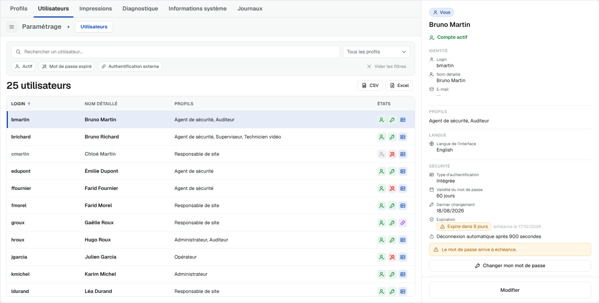

#### 5.5.1 Expiration du mot de passe

Expiration = **date du dernier changement + validité (jours)**. Seuils issus de
`configuration.passwordPolicy` (défaut : `warnDays` 15, `dangerDays` 5).

| Niveau | Condition | Affichage |
|---|---|---|
| sans objet | validité vide / 0, ou authentification externe | « Sans expiration » |
| inconnu | date du dernier changement absente | « Date du dernier changement inconnue » |
| ok | > 15 j | pastille verte « Expire dans *n* jours » |
| alerte | ≤ 15 j | pastille orange + bandeau « Le mot de passe arrive à échéance. » |
| danger | ≤ 5 j | pastille rouge + bandeau « Le mot de passe expire très prochainement. » |
| expiré | < 0 j | pastille rouge « Expiré depuis *n* jours » + bandeau « Le mot de passe est expiré : il doit être changé. » |

Libellés particuliers : « Expire aujourd'hui », « Expire demain », « Expiré depuis 1 jour ».

#### c) Formulaire (modification / création)

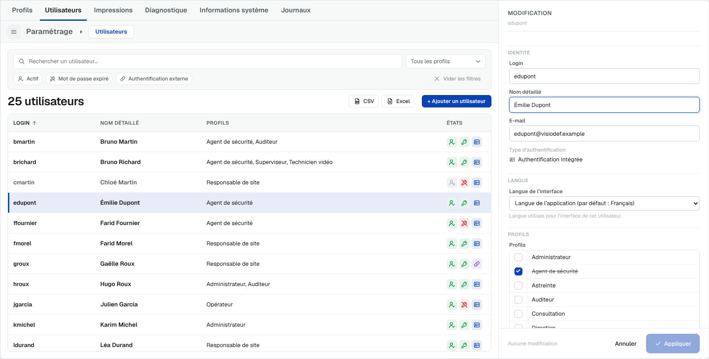
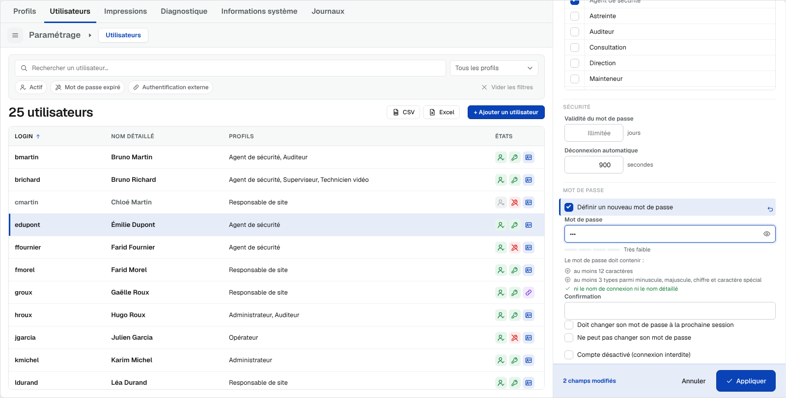

| Section | Champ | Type | Règles |
|---|---|---|---|
| En-tête | — | — | « MODIFICATION » + login, ou « NOUVEL UTILISATEUR » ; bandeau « Vous modifiez votre fiche personnelle. » sur sa fiche |
| IDENTITÉ | **Login** | texte, 64 car. | Obligatoire, unique, caractères autorisés : lettres, chiffres, `.` `_` `@` `-` |
| | **Nom détaillé** | texte, 120 car. | Obligatoire |
| | E-mail | texte, 120 car. | Facultatif ; format contrôlé |
| | Type d'authentification | **lecture seule** | Paramètre système : `configuration.directory` pour un nouveau compte ; jamais modifiable dans la fiche |
| LANGUE | Langue de l'interface | liste | « Langue de l'application (par défaut : …) », Français, English ; aide « Langue utilisée pour l'interface de cet utilisateur. » (ou « … pour votre interface dès la prochaine ouverture. » sur sa fiche) |
| PROFILS | Profils | liste à **cases à cocher** de tous les profils, triés par nom | Profil inactif **barré** ; profil inconnu conservé coché (italique) |
| SÉCURITÉ | Validité du mot de passe | entier ≥ 0, en jours | Vide = « Illimitée » ; *authentification intégrée seulement* |
| | Expiration | lecture seule | Rappel du délai restant (modification, authentification intégrée) |
| | Déconnexion automatique | entier ≥ 0, en secondes | Vide = « Jamais » |
| MOT DE PASSE | *(authentification intégrée)* « Définir un nouveau mot de passe » | case | En modification ; en création la saisie est directe et obligatoire |
| | Mot de passe actuel | mot de passe | **Uniquement quand l'opérateur change le sien** ; obligatoire |
| | Mot de passe + œil | mot de passe, 128 car. | Jauge de robustesse (Très faible → Très fort) et **critères de complexité cochés en direct** (§ 7) |
| | Confirmation | mot de passe | Identique à la saisie |
| | Doit changer son mot de passe à la prochaine session | case | Exclusive de la suivante |
| | Ne peut pas changer son mot de passe | case | Exclusive de la précédente |
| | *(authentification externe)* note | — | « Authentification externe : le mot de passe est géré en dehors de VisioDEF. » |
| — | Compte désactivé (connexion interdite) | case | — |
| Pied collant | — | — | « *n* champs modifiés » · **Annuler** · **Appliquer** (grisé tant que rien n'a changé) ou **Créer l'utilisateur** |

**Suivi des champs** : tout champ modifié par rapport à l'état initial porte un **liseré
bleu** et un bouton **Rétablir** (↶) qui restaure sa valeur. Raccourcis : **Ctrl+Entrée**
(ou Entrée dans un champ) applique ; **Échap** annule.

**Valeurs par défaut en création** : authentification = `configuration.directory`
(défaut « local » = intégrée), validité = `defaultPasswordValidityDays`, déconnexion =
`defaultLogoutDelaySeconds`, compte actif, aucune option, aucun profil.

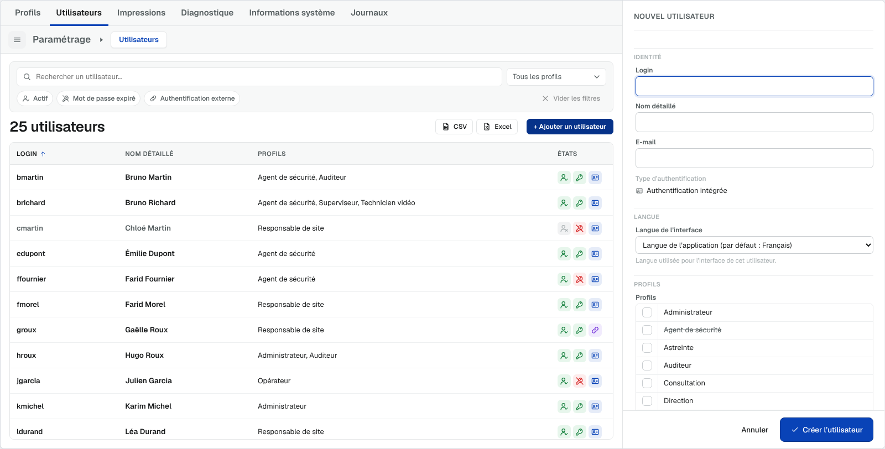

## 6. Fonctions

### 6.1 Consulter un compte
Clic sur une ligne → panneau en consultation ; `selectedUser_json` `{ id, user }` (jamais de
mot de passe).

### 6.2 Créer un compte
1. **+ Ajouter un utilisateur** → formulaire « NOUVEL UTILISATEUR ».
2. Saisie ; **Créer l'utilisateur** → contrôles (§ 7), erreurs affichées sous les champs,
   focus sur le premier champ en erreur.
3. Compte créé avec un identifiant provisoire `user-…`, sans historique de connexion ;
   date de dernier changement du mot de passe = jour de création.
4. `userChanges_json` `{ action: "create", user, password }` ; compteurs *Utilisateurs* des
   profils concernés mis à jour localement ; toast « Utilisateur créé. ».

### 6.3 Modifier un compte
Bouton **Modifier**, double-clic ou menu contextuel → formulaire pré-rempli.
**Appliquer** → `userChanges_json` `{ action: "update", user, password?, currentPassword? }` ;
toast « Utilisateur enregistré. ». Si rien n'a changé, *Appliquer* referme simplement le
formulaire.

### 6.4 Supprimer un compte

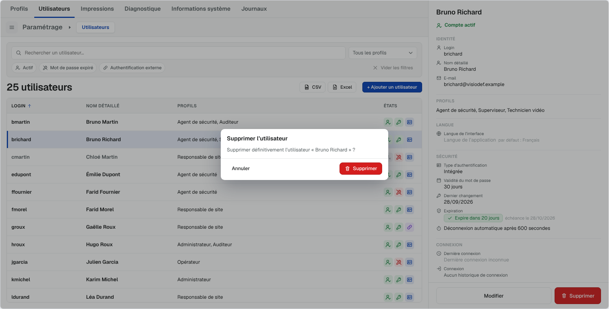

| Cas | Comportement |
|---|---|
| **Sans historique de connexion** (`hasLoginHistory = false`) | Dialogue « Supprimer l'utilisateur » — « Supprimer définitivement l'utilisateur « *X* » ? » — **Annuler** / **Supprimer** → `userChanges_json` `{ action: "delete" }`, toast « Utilisateur supprimé. » |
| **Avec historique**, compte actif | Dialogue « Suppression impossible » — « … possède un historique de connexion : il ne peut pas être supprimé. Voulez-vous le désactiver ? » — **Annuler** / **Désactiver** |
| **Avec historique**, compte déjà désactivé | Même dialogue, informatif (« Il est déjà désactivé. ») — **Fermer** |

### 6.5 Désactiver / réactiver un compte
Menu contextuel ou bouton **Réactiver** du panneau (droit `edit`) →
`userChanges_json` `{ action: "disable" | "enable" }` (raccourcis d'une mise à jour de
`enabled`) ; toasts « Utilisateur désactivé. » / « Utilisateur réactivé. ».

### 6.6 Fiche personnelle (formulaire contextuel)

Les champs modifiables dépendent de l'opérateur et de la fiche ouverte :

| Champ | Avec droit `edit` (toutes fiches) | Sans droit `edit` — **sa** fiche | Sans droit `edit` — autre fiche |
|---|---|---|---|
| Login | modifiable | lecture | — (pas de bouton Modifier) |
| Nom détaillé, e-mail, langue | modifiable | **modifiable** | — |
| Profils, validité, déconnexion, options, désactivation | modifiable | lecture | — |
| Mot de passe | modifiable (intégrée) | **modifiable** (intégrée, sauf « Ne peut pas changer… ») | — |
| Mot de passe actuel exigé | sur sa propre fiche | **oui** | — |

Authentification externe : ni mot de passe ni validité, quel que soit l'opérateur. Sans
opérateur connu (ni `currentUser` ni réponse à `session.moi`) : formulaire complet sous le
droit `edit`, ni badge « Vous » ni bouton de mot de passe personnel.

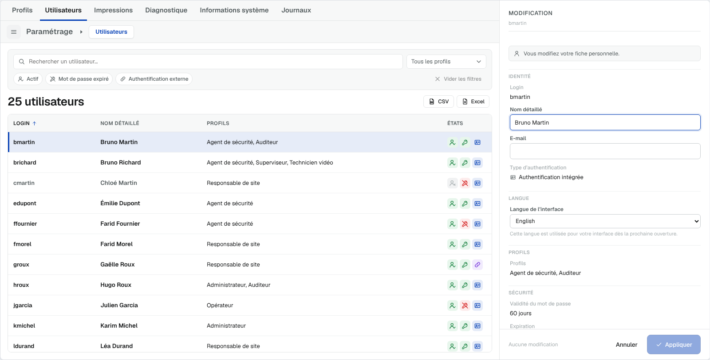

### 6.7 Changer son mot de passe (dialogue)

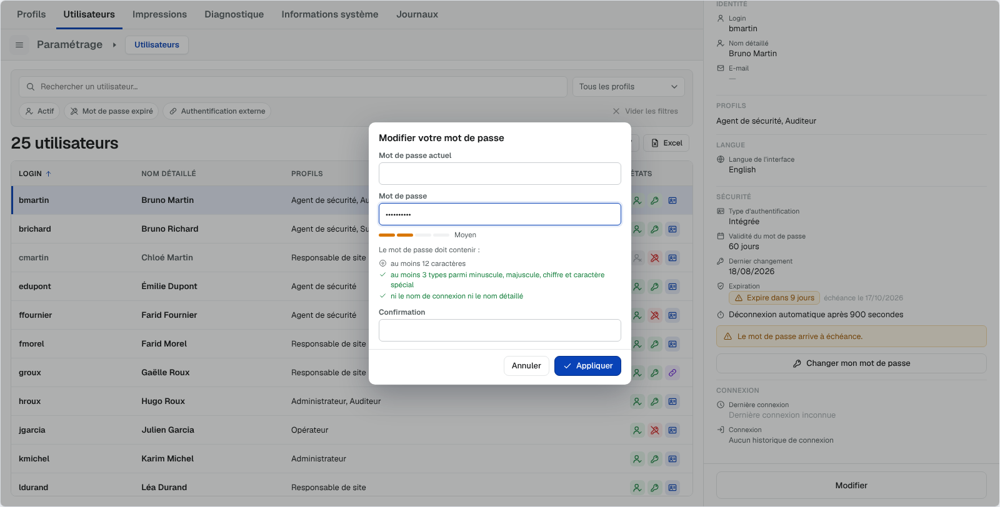

Ouvert par **Changer mon mot de passe** (sa fiche, authentification intégrée, option
« Ne peut pas changer » absente). Dialogue « Modifier votre mot de passe » : *Mot de passe
actuel*, *Mot de passe* (jauge + critères en direct), *Confirmation* ; **Annuler** /
**Appliquer** (Entrée), Échap ferme.

| Contrôle | Message |
|---|---|
| Mot de passe actuel vide | « Le mot de passe actuel est obligatoire. » |
| Politique non respectée | « Le mot de passe ne respecte pas la politique de sécurité. » |
| Nouveau = actuel | « Le nouveau mot de passe doit être différent de l'actuel. » |
| Confirmation différente | « Les deux saisies diffèrent. » |
| Refus serveur `wrongPassword` | « Le mot de passe actuel est incorrect. » |

Vérification : par le serveur (`serverRequest_json`, action `session.motDePasse`
`{ login, ancien, nouveau }`) si la liaison existe ; sinon relais par `userChanges_json`
`{ action: "password", currentPassword, password }`. Succès : toast « Mot de passe
modifié. », date du dernier changement rafraîchie, option « Doit changer son mot de passe »
levée.

### 6.8 Garde-fou « Modifications non appliquées »

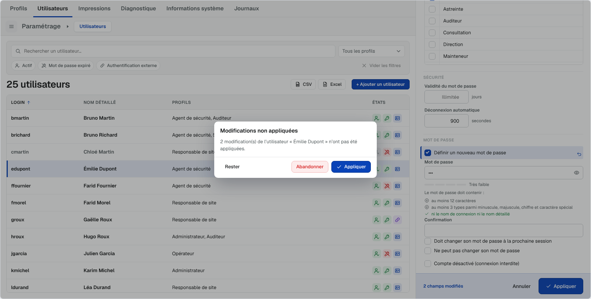

Déclenché lorsqu'un formulaire modifié (ou une création en cours) est quitté par : changement
de sélection, de rubrique, clic sur un lien vers un profil, suppression, ouverture d'une
autre fiche.

> « *n* modification(s) de l'utilisateur « *X* » n'ont pas été appliquées. »
> (création : « La création de l'utilisateur « *X* » n'a pas été validée. »)
> **Rester** · **Abandonner** · **Appliquer** (ou **Créer l'utilisateur**).

**Annuler** / Échap sur un formulaire modifié propose seulement **Rester** / **Abandonner**.
Le renvoi de `users_json` ou `profiles_json` par l'application **conserve le brouillon**.

## 7. Contrôles de saisie et politique de mot de passe

| Champ | Contrôle | Message |
|---|---|---|
| Login | obligatoire | « Le nom (login) est obligatoire. » |
| Login | format `[A-Za-z0-9._@-]+` | « Lettres, chiffres, point, tiret, arobase et souligné uniquement. » |
| Login | unicité (insensible casse / accents) | « Un utilisateur porte déjà ce nom. » |
| Nom détaillé | obligatoire | « Le nom détaillé est obligatoire. » |
| E-mail | format | « Adresse e-mail invalide. » |
| Mot de passe (création, intégrée) | obligatoire | « Le mot de passe est obligatoire en authentification intégrée. » |
| Mot de passe | politique | « Le mot de passe ne respecte pas la politique de sécurité. » |
| Confirmation | égalité | « Les deux saisies diffèrent. » |
| Validité / déconnexion | entier positif ou vide | (valeur non numérique ignorée = illimité) |

**Politique** (`configuration.passwordPolicy`, défaut `{ minLength: 12, classes: 3,
forbidLogin: true, warnDays: 15, dangerDays: 5 }`) — critères affichés « Le mot de passe
doit contenir : » :

- au moins *minLength* caractères (borné à [8, 64]) ;
- *classes* = 1 à 3 : « au moins *n* types parmi minuscule, majuscule, chiffre et caractère
  spécial » ; *classes* = 4 : une ligne par type ; 0 : aucune exigence ;
- *forbidLogin* : « ni le nom de connexion ni le nom détaillé » (ni aucun de leurs mots
  d'au moins 3 caractères).

Les mêmes règles sont **répliquées côté extension .NET** (`MyPnPaPolitiqueMdp`) : le client
ne fait jamais foi seul.

## 8. Exports

| Format | Contenu |
|---|---|
| **CSV** | UTF-8 avec BOM, séparateur « ; », `<exportFileName \| utilisateurs>-AAAA-MM-JJ.csv` |
| **Excel** | .xlsx natif, feuille *Utilisateurs*, en-tête gras figé, filtre automatique |

- Colonnes : Login, Nom détaillé, E-mail, Profils, Validité mot de passe (j),
  Déconnexion (s), Type d'authentification, Statut, Dernière connexion — un compte = une
  ligne.
- Périmètre : **liste affichée** (tri, recherche et filtres en cours : seuls les comptes
  visibles sont exportés).
- Jamais de mot de passe. `exportRequest_json` porte le filtre (`filter`, critères non vides).
- Impression disponible par l'API `exportView('print', 'users')` (pas de bouton).

## 9. Règles de gestion

| Réf. | Règle |
|---|---|
| RG-USR-01 | 30 comptes au maximum : au-delà, ignorés ; création bloquée |
| RG-USR-02 | Login obligatoire, unique, au format `[A-Za-z0-9._@-]+` ; nom détaillé obligatoire |
| RG-USR-03 | Le type d'authentification est un paramètre système : fixé à la création (`configuration.directory`), jamais modifiable dans la fiche |
| RG-USR-04 | Authentification externe : pas de mot de passe, pas de validité, pas d'expiration |
| RG-USR-05 | Un compte possédant un historique de connexion ne peut pas être supprimé ; il peut être désactivé |
| RG-USR-06 | « Doit changer son mot de passe… » et « Ne peut pas changer son mot de passe » sont exclusives |
| RG-USR-07 | Changer **son** mot de passe exige toujours le mot de passe actuel, vérifié par le serveur |
| RG-USR-08 | Un compte est « expiré » si dernier changement + validité < aujourd'hui ; sans validité, date inconnue ou authentification externe = valide |
| RG-USR-09 | Le mot de passe ne figure jamais dans `users_json`, `selectedUser_json`, les exports ; il ne transite que dans `userChanges_json` (`password`, hors objet `user`) |
| RG-USR-10 | L'identifiant d'un compte créé est généré par l'objet (`user-…`) ; l'application peut le remplacer en renvoyant `users_json` |
| RG-USR-11 | Après un changement de compte, les listes `users[]` des profils concernés sont mises à jour localement (compteur *Utilisateurs* de la rubrique Profils) |
| RG-USR-12 | Une langue d'interface non prise en charge est ignorée (langue de l'application) |
| RG-USR-13 | Filtres : profils en OU entre eux ; recherche, profils et états cumulés en ET |

## 10. Droits de l'opérateur

| Droit | Défaut | Effet dans l'affichage Utilisateurs |
|---|---|---|
| `create` | oui | « + Ajouter un utilisateur » |
| `edit` | oui | Modifier toutes les fiches (formulaire complet), Désactiver / Réactiver |
| `delete` | oui | Supprimer (ou proposer la désactivation) |
| `export` | oui | Boutons CSV / Excel |
| *(aucun)* | — | Consultation de toutes les fiches ; modification limitée de **sa** fiche (§ 6.6) |

## 11. Interfaces (propriétés Panorama)

| Propriété | Sens | Contenu |
|---|---|---|
| `configuration_json` | lue | `userColumns`, `usersSort`, `currentUser`, `passwordPolicy`, `directory`, `defaultPasswordValidityDays`, `defaultLogoutDelaySeconds`, `rights`, `locale`, `texts`… |
| `users_json` | lue | `[ { id, login, name, email, profiles: [ids], directory: local \| external, passwordValidityDays, logoutDelaySeconds, enabled, mustChangePassword, cannotChangePassword, hasLoginHistory, lastLogin, lastPasswordChange, locale, extra } ]` |
| `profiles_json` | lue | Libellés et état actif des profils (cf. SG-01) |
| `selectedUser_json` | écrite | `{ id, user }` / `{ id: null, user: null }` |
| `userChanges_json` | écrite | `{ action: create \| update \| delete \| disable \| enable \| password, user, password?, currentPassword? }` |
| `navigationRequest_json` | écrite | `{ target: "section", section: "profiles", source: "user" }` (Voir le profil) |
| `exportRequest_json` | écrite | `{ section: "users", scope: "view", format, handled, count, sort, query, filter }` |
| `viewState_json` | écrite | `{ selectedUserId, usersSort, usersQuery, usersFilter, pendingUserFields, usersCount }` |
| `serverRequest_json` / `serverResponse_json` | écrite / lue | `session.moi` (opérateur connecté), `session.motDePasse` (changement de son mot de passe) |

Traitement côté Panorama (`OnChangeApplyParametrage.cs`) : `MyPnPaApplyUserChange`
(ou `MyPnPaChangeOwnPassword` pour l'action `password`), relecture de `users_json` et
`profiles_json`, remise à `""` de `userChanges_json`.

API publique associée : `setUsersFilter({ profiles, enabled, expired, external })`,
`getUsersFilter()`, `clearUsersFilters()`, `selectUser(id)`, `getUsers()`.

## 12. Ergonomie et accessibilité

- Navigation clavier complète (tableau, tri, menu contextuel, formulaire).
- Tableau `role="grid"`, lignes avec `aria-selected` ; pastilles `aria-pressed` ; liste des
  profils `aria-multiselectable`.
- Police unique (plus de police à chasse fixe dans la gestion des utilisateurs).
- Textes français / anglais avec parité vérifiée ; surcharge par `configuration.texts`.

## 13. Écarts relevés entre `readme.txt` et le code livré

| # | `readme.txt` | Code livré (fait foi ici) |
|---|---|---|
| E1 | En-tête du code `param-userpanel.js` : « badges Actif / Désactivé, annuaire, n profils », « pills cliquables » | Consultation épurée : badge « Vous » seul, profils **en texte** (les pills « Voir le profil » ne sont plus cliquables en consultation ; accès par le menu contextuel) |
| E2 | `allowDirectoryChoice` | Sans effet : type d'authentification toujours en lecture seule |
| E3 | Captures `tests/bench-6/7/14-*.png` (affichage « Par profil », colonnes Validité / Déconnexion, avatars) | Obsolètes depuis le 2026-10-08 : les captures de ce document sont à jour |
| E4 | Menu contextuel : « Voir le profil X » pour chaque profil | Limité aux **6 premiers** profils (ordre alphabétique) |
